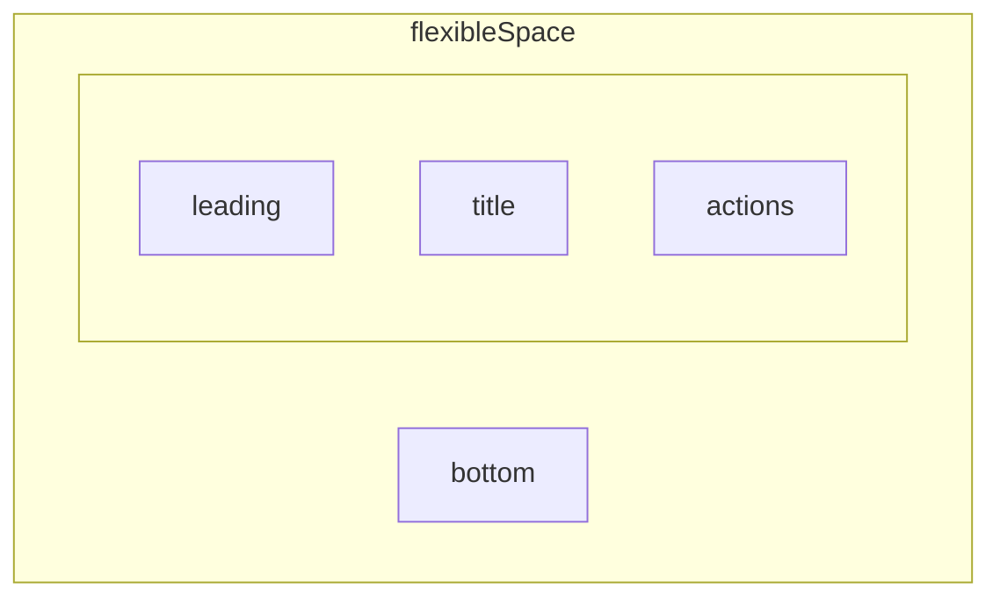

{/* // import Mermaid from '@/components/Mermaid.js'; */}


# flutter 
VScode 中 （Shift+Cmd+P）。开始输入“flutter new"
``` flutter
import 'package:flutter/material.dart';

void main() {
  runApp(
    Text(
      ("hello world"),
      textDirection: TextDirection.rtl,
      style: TextStyle(fontSize: 100, color: Colors.white),
    ),
  );
}

// class MyApp(){

// }

```

- runApp 把传入的的 `Widget`显示在屏幕上，`Widget` 是 abstract class只能创建子类
- flutter中所有的页面显示元素都是Widget的子类,
- MaterialApp主题，这样可以不用给Widget写方向，否则都要设置方向
- MaterialApp 是主题,自带方向设置,所以他里面的包含的widget都不需要设置方向
- 在你的pubspec.yaml文件的flutter部分中有一个uses-material-design: true，为了使用预定义的Material图标集

``` 
ios/runner/info.plist
···
<key>FLTEnableImpeller </key>
	<false/>
···

//pubspec.yaml文件
name: my_app
flutter:
  uses-material-design: true

import 'package:flutter/material.dart';

void main() {
runApp(MaterialApp(
  home:Text('appp',style: TextStyle(fontSize: 100, color: Colors.white)),

));
}
```
## const 
 Widget的嵌套,这里演示 Center居中组件 里面 child参数 嵌套 文本框Text

//注意函数返回类型不能不写,否则就变成dynamic 会报错

const 嵌套问题，最外层用了const，那么里面就不用加，如果里面有单独的不是const的，那么最外层不能是const
```
import 'package:flutter/material.dart';

void main() {
  String str="baby";
runApp(
  MaterialApp(
  home:Center( 
    child: 
    Text(str,style: const TextStyle(fontSize: 100, color: Colors.white)), )

));
}
```
## scaffold 


```dart
void main() {
  //变量在这里
  runApp(
    MaterialApp(
      home: Scaffold(
        appBar: AppBar(
          // leading: Text("左侧"),
          leading: Icon(Icons.home),
          title: Text("navbar "),
          actions: [Text('back'), Icon(Icons.add)],
        ),
        floatingActionButton: FloatingActionButton(
          onPressed: () {
            print('点击了 ');
          },
          // child: Icon(Icons.add),
          child: Text('click'),
        ),
        body: Row(
          children: [
            // Spacer(),//
            TextButton(
              onLongPress: (){
                print('long press');
              },
              onPressed: () {
                // print('TextBUtn点击了 ');
              },
              child: Text('click me right now'),
            ),
            TextButton(
              onPressed: () {
                print('TextBUtn点击了 ');
              },
              child:Icon(Icons.holiday_village) 
            ),
           GestureDetector(
              onDoubleTap: (){
                print('双击了！！');
              },
              onLongPress: (){
                print('长安了');
              },
            child:Text('Gensture')
            ), 
          ],
        ),
      ),
    ),
  );
}
// class MyApp(){

// }

```
**GestureDetector** 
             GestureDetector小部件没有视觉表示，而是检测用户进行的手势。
            当用户点击child时，GestureDetector调用其回调函数
## build 
### build 可以嵌套
```dart
import 'package:flutter/material.dart';

main(){
  //runApp把home参数里面的Widget画到屏幕上
    runApp(MaterialApp(home: Widget1()));
}
class Widget1 extends StatelessWidget {
  const Widget1({super.key});

  @override
  Widget build(BuildContext context) {
    return Column(
      children: <Widget>[
        Text("000"),
        Text("111"),
        Widget2(),
      ],
    );

  }
}
class Widget2 extends StatelessWidget {
  const Widget2({super.key});

  @override
  Widget build(BuildContext context) {

    //这里Widget2对象把build里面返回的Widget作为Widget使用,
    // 返回给上一层,所以上一层的row,就变成了 111 spacer 222
    return Column(
      children: [
        Text("222"),
        Widget3()
      ],
    );
  }
}
class Widget3 extends StatefulWidget {
  const Widget3({super.key});
  @override
  State<Widget3> createState() => _Widget3State();
}
//build可以嵌套,把return的Widget一层层,向上返回
class _Widget3State extends State<Widget3> {
  int i = 0;
  @override
  Widget build(BuildContext context) {
    return Column(
      children: <Widget>[Text("333"),ElevatedButton(onPressed: (){
      print("${++i}");
      setState(() {
      });
      }, child: Text("$i")//此处的i只能在 _Widget3State 里找
      )
      ]
    );
  }
}
```
更改界面 **StatefulWidget**中的**build**
- stful cmd + i
- stf 快速生成StatefulWidget
- stl 快速生成StatelessWidget
```dart
import 'package:flutter/material.dart';

void main() {
  runApp(
    MaterialApp(
    home:Row(children: [
    Text('44'),//这里不会被热启动 不在build里面
    Spacer(),
    MyApp( ),
    ],) 
    ),

  );
}
// class MyApp(){
class MyApp extends StatefulWidget {
  const MyApp({super.key});

  @override
  State<MyApp> createState() => _MyAppState();
}

class _MyAppState extends State<MyApp> {
  @override
  Widget build(BuildContext context) {
    return Text('abc');//不写return 就写成箭头函数
  }
}

// }

```
### state not working
```dart
import 'package:flutter/cupertino.dart';
import 'package:flutter/material.dart';

void main() {
  runApp(
    MaterialApp(
      home: Row(
        children: [
          Text('54'), //这里不会被热启动 不在build里面
          Spacer(),
          MyApp(),
        ],
      ),
    ),
  );
}

class MyApp extends StatefulWidget {
  const MyApp({super.key});

  @override
  State<MyApp> createState() => _MyAppState();
}

class _MyAppState extends State<MyApp> {
  int i = 0;
  //热启动会刷新build方法里面的内容,不在build方法里面的内容不会被刷新
  //build方法会把里面的内容,一层一层的向上返回,并且描述到屏幕上
  @override
  Widget build(BuildContext context) {
    print('build 执行了');
    return Row(
      children: [
        ElevatedButton(
          onPressed: () {
            print('btn click${++i}times');
          },
          child: Text("$i"),
        ),
      ],
    );
  }
}
```
**正确示范**
```dart title="main.dart" {13-15}
···
class _MyAppState extends State<MyApp> {
  int i = 0;
  //热启动会刷新build方法里面的内容,不在build方法里面的内容不会被刷新
  //build方法会把里面的内容,一层一层的向上返回,并且描述到屏幕上
  @override
  Widget build(BuildContext context) {
    print("build执行了");
    return Row(children: [
      Text("${i}"),
      ElevatedButton(onPressed: (){
        print("按钮点击了${++i}");
        setState(() {
          print("abc");
        });
      }, child:Text("$i") )
    ],);
  }
}

```
### stateless
- stl 快速生成StatelessWidget
```dart title="main.dart"{2,3}
class Widget1 extends StatelessWidget{
  // const Widget1({ super.key });//简写
  const Widget1({Key? key}):super(key: key);//初始化列表的语法方法
  @override
  Widget build(BuildContext context) {
    // TODO: implement build
    return Text("000");
  }

}
```


**快捷键**
- 调出 Refactor 菜单。在 VS Code 中，您可以通过以下两种方式之一执行此操作：

- 右键点击要重构的代码段（在本例中为 Text），然后从下拉菜单中选择 Refactor...，
或者

- 将光标移到要重构的代码段上（在本例中为 Text），然后按下 Ctrl+. (Win/Linux) 或 Cmd+. (Mac)。
- 在 Refactor 菜单中，选择 Extract Widget。指定一个名称，例如 BigCard，然后点击 Enter 键。

这会在当前文件的末尾自动创建一个新的 BigCard 类。
### state生命周期
stateless widget 没有生命周期
```dart
class _HomePageState extends State<HomePage> {
  @override
  void initState() {
    // TODO: implement initState
    super.initState();
    //必须调用
  }
  @override
  Widget build(BuildContext context) {
    return Text('abc');
  }
```

响应小部件生命周期事件
在 StatefulWidget 上调用 createState() 后，框架会将新的状态对象插入到树中，然后调用状态对象的 initState()。
State 的子类可以重写 initState()，以执行只需要在初始化时发生的工作。
例如，可以重写 initState() 来配置动画或订阅平台服务。实现 initState() 的必须以调用 super.initState 开头。
当不再需要状态对象时，框架会调用状态对象的 dispose()。重写 dispose() 函数以执行清理工作。
例如，可以重写 dispose() 来取消定时器或取消订阅平台服务。dispose() 的实现通常以调用 super.dispose 结束。 
## 布局
- Container
```dart
    return Container(
      width: double.maxFinite,
      color: Colors.blue,
      height: 100,
      alignment: Alignment.center,//child居中对齐
      child: Text('abc',style: TextStyle(fontSize: 40,color:Colors.deepOrange,backgroundColor: Colors.green)),
      );
       
       or
   return Container(
          // width: double.maxFinite,//最大尺寸
        width: 200,
        height: 100,

        // alignment: Alignment.bottomRight,//居中对齐
        child: Text("abc",
            textAlign: TextAlign.center,//无法通过Text自己的居中来让Text居中到屏幕中间
            style: TextStyle(fontSize: 40,color: Colors.yellow,backgroundColor: Colors.green)),
      );
```
- row
```dart
    return Row(
      mainAxisAlignment: MainAxisAlignment.center,
      children: <Widget>[
        Text(
          'abc',
          style: TextStyle(
            fontSize: 40,
            color: Colors.deepOrange,
            backgroundColor: Colors.green,
          ),
        ),
      ],
    );
```
-  mainAxisAlignment: MainAxisAlignment.spaceEvenly,//均匀分布子控件,两边顶头也有空间
- mainAxisAlignment: MainAxisAlignment.spaceBetween,//均匀分布子控件,两边顶头没有空间
- mainAxisAlignment: MainAxisAlignment.spaceAround,//中间分布平均的控件,两边顶头的用一半的中间的空间

- //交叉轴默认对齐方式是center ,主轴是start
- crossAxisAlignment: CrossAxisAlignment.stretch,//只有交叉轴有拉伸stretch是拉伸,下面container会被拉伸Text不会被拉伸
- crossAxisAlignment: CrossAxisAlignment.start,//顶端对齐
- crossAxisAlignment: CrossAxisAlignment.end,//交叉轴底部对齐

> decoration 中声明 color